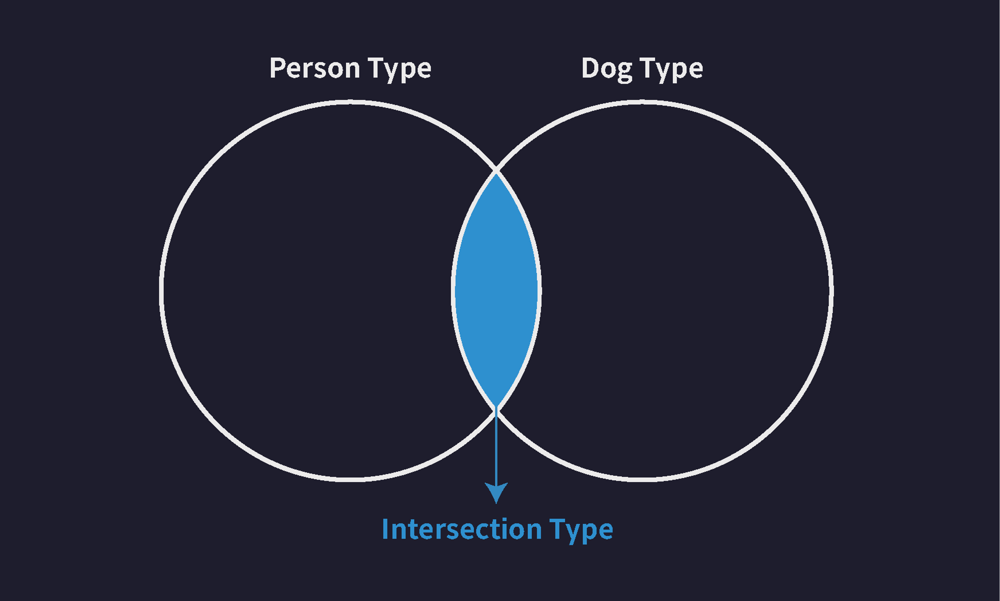

# 타입스크립트 seciton 1~4 정리
## 목차
1. [Section 1. 들어가며](#section-1-들어가며)
2. [Section 2. 타입스크립트 개론](#section-2-타입스크립트-개론)
3. [Section 3. 타입스크립트 기본](#section-3-타입스크립트-기본)
4. [Section 4. 타입스크립트 이해하기](#section-4-타입스크립트-이해하기)
## Section 1. 들어가며
### Node.js 환경에서 타입스크립트를 작성 및 실행 가능하다
### npm(Node Package Manager)는 Node.js 설치시 함께 설치되는 도구입니다. npm은 Node.js의 패키지 매니저라는 뜻으로 Node.js 패키지를 설치하고 삭제하고 버전을 업그레이드 하는 등의 기능을 제공합니다.
### IDE는 VsCode를 사용한다.
## Section 2. 타입스크립트 개론
### 타입스크립트는 자바스크립트의 확장판이다
타입스크립트는 기존의 자바스크립트를 더 안전하게 사용할 수 있도록 타입 관련된 여러가지 기능들을 추가한 언어입니다. 그래서 타입스크립트는 쉽게 말해서 자바스크립트의 확장판 이라고 부를 수 있습니다.
타입스크립트는 더 복잡한 상황에서 더 대규모의 프로그램을 만들기 위해 자바스크립트를 안정적으로 사용할 수 있도록 타입 이라는 안전장치를 하나 추가한 언어라고 이해할 수 있습니다.
### 동적 타입 시스템
자바스크립트가 사용하는 동적 타입 시스템은 기본적으로 변수의 타입들을 코드가 실행 되는 도중에 결정하기 때문에 우리가 미리 변수에 타입을 설정하지 않아도 된다는 유연함을 장점으로 갖습니다.
### 정적 타입 시스템
반면에 C나 Java 같은 언어들은 정적 타입 시스템을 가지고 있는데요정적 타입 시스템은 코드를 실행하기 전에 모든 변수의 타입을 결정합니다. 자바스크립트와는 반대로 변수를 선언 함과 동시에 타입도 함께 명시해 주어야 합니다.
### 타입스크립트와 점진적 타이핑
타입스크립트는 좀 독특한 타입 시스템을 사용하는데요 마치 자바스크립트의 동적 타입 시스템과 자바의 정적 타입 시스템을 혼합한 것 같은 그런 독특한 타입시스템을 사용합니다.
### 타입스크립트의 동작 과정
타입스크립트의 컴파일 결과로 만들어진 자바스크립트 코드를 Node.js나 웹브라우저로 실행하면 대다수의 언어들과 동일한 과정을 거쳐 컴파일 되어 실행됩니다.
### 타입스크립트 준비과정
- Node.js 패키지 초기화
- @types/node 설치 : @types/node 라이브러리는 Node.js가 제공하는 기본 기능(내장 함수, 클래스 등)에 대한 타입 정보를 가지고 있습니다. 
- 타입스크립트 컴파일러 설치 : 타입스크립트 컴파일러(TSC)는 npm의 TypeScript 패키지에 동봉되어 있습니다. 자바스크립트를 실행하기 위해 Node.js를 설치하는 것 처럼 타입스크립트를 컴파일 하기 위해서는 타입스크립트 패키지를 설치해 주어야 합니다.
- 타입스크립트 실행 ```> tsc src/index.ts```
> tex로 실행하기 : 타입스크립트 코드를 실행하기 위해 tsc를 이용해 타입스크립트 코드를 자바스크립트로 변환한 다음 변환된 자바스크립트 코드를 Node.js로 실행시켰습니다. 정리하면 tsc 그리고 node 2번의 명령어를 사용해 타입스크립트 코드를 실행했습니다.tsx는 단 한번의 명령어로 타입스크립트 코드를 실행시켜주는 도구입니다.```> tsx src/index.ts```
### 컴파일러 옵션
컴파일 과정에서 아주 세부적인 사항들 예를 들어 얼마나 엄격하게 타입 오류를 검사할 건지 또는 컴파일 결과 생성되는 자바스크립트 코드의 버전은 어떻게 할 것인지 등의 컴파일의 아주 세부적인 사항들을 컴파일러 옵션이라고 합니다.
컴파일러의 옵션을 우리가 직접 설정한다는 건 이런 사항들을 프로그래머가 자신의 입맛에 맞게 자유롭게 변경하는 행위를 말합니다. 
```TypeScript
{
  "compilerOptions": {
    "target": "ESNext",
    "module": "ESNext",
    "outDir": "dist",
		"moduleDetection": "force"
  },
  "include": ["src"]
}
```
- include 옵션 : tsc에게 컴파일 할 타입스크립트 파일의 범위와 위치를 알려주는 옵션입니다.
- target 옵션 : 컴파일 결과 생성되는 자바스크립트 코드의 버전을 설정
- module 옵션 : 변환되는 자바스크립트 코드의 모듈 시스템을 설정
- outDir 옵션 : 컴파일 결과 생성할 자바스크립트 코드의 위치를 결정
- strict 옵션 : 컴파일러의 타입 검사 엄격함 수준을 정함
- ModuleDetection 옵션 : moduleDection 옵션을 force로 설정할 경우 자동으로 모든 타입스크립트 파일이 로컬 모듈(독립 모듈)로 취급됩니다.
## Section 3. 타입스크립트 기본
### 기본 타입(Basic Types)
기본 타입이란 타입스크립트가 자체적으로 제공하는 타입들을 말합니다. 기본 타입을 다른 말로는 내장 타입이라고도 할 수 있습니다.
### 원시 타입(Primitive Type)
원시 타입(Primitive Type)은 동시에 한개의 값만 저장할 수 있는 타입들을 말합니다. 예를 들어 원시 타입이 아닌 배열이나 객체 같은 비 원시 타입들은 동시에 여러개의 값들을 저장할 수 있는 반면, number, string, boolean 등의 원시 타입은 숫자면 숫자, 문자열이면 문자열 딱 하나의 값만 저장할 수 있습니다.
- number
- string
- boolean
- null
- undefined
### 리터럴 타입
타입스크립트에는 string, number 처럼 범용적으로 많은 값을 포함하는 타입 뿐만 아니라 딱 하나의 값만 포함하는 타입도 존재합니다. 따라서 다음과 같이 변수의 타입을 숫자 10으로 설정하는 것 또한 가능합니다. (리터럴의 뜻은 '값')<br/>
```let numA: 10 = 10;```<br/>
이렇게 설정하면 이제 numA에는 10 이외의 값을 저장할 수 없게 됩니다.
### 배열
```let numArr: number[] = [1, 2, 3]```<br/>
```let strArr: string[] = ["hello", "im", "winterlood"];```<br/>
```TypeScript
let boolArr: Array<boolean> = [true, false, true];
```
```let multiArr: (number | string)[] = [1, "hello"];```<br/>
```TypeScript
let doubleArr : number[][] = [
  [1, 2, 3], 
  [4, 5],
]
```
### 튜플
길이와 타입이 고정된 배열을 의미합니다.<br/>
```let tup2: [number, string, boolean] = [1, "hello", true];```
> 회원 정보를 관리할 때 '이름', '아이디'순서로 저장해야하는 상황에서 '아이디' '이름'순으로 자장하면 안되는 경우와 같은 상황에서 유용하게 사용
### 객체
```TypeScript
let user: {
  id?: number;
  readonly name: string; // name은 이제 Readonly 프로퍼티가 되었음
} = {
  id: 1,
  name: "이정환",
};

user.name = "dskfd"; // 오류 발생
```
```id?: number;```는 id프로퍼티는 생략 가능한 선택적 프로퍼티라는 의미
### 타입 별칭(Type Alias)
타입 별칭을 이용하면 다음과 같이 변수를 선언하듯 타입을 별도로 정의하고 사용 가능
```TypeScript
type User = {
  id: number;
  name: string;
  nickname: string;
  birth: string;
  bio: string;
  location: string;
};

let user: User = {
  id: 1,
  name: "이정환",
  nickname: "winterlood",
  birth: "1997.01.07",
  bio: "안녕하세요",
  location: "부천시",
};

let user2: User = {
  id: 2,
  name: "홍길동",
  nickname: "winterlood",
  birth: "1997.01.07",
  bio: "안녕하세요",
  location: "부천시",
};
```
### 인덱스 시그니처(Index Signature)
객체 타입을 유연하게 정의할 수 있도록 돕는 문법
```TypeScript
type CountryCodes = {
  [key: string]: string; //인덱스 시그니처
};

let countryCodes: CountryCodes = {
  Korea: "ko",
  UnitedState: "us",
  UnitedKingdom: "uk",
  // (... 약 100개의 국가)
  Brazil : 'bz'
};
```
### 열거형(Enum) 타입
열거형은 다음과 같이 여러개의 값을 나열하는 용도로 사용합니다. (Enum은 enumeration 줄임말)
```TypeScript
// enum 타입
// 여러가지 값들에 각각 이름을 부여해 열거해두고 사용하는 타입

enum Role {
  ADMIN = 0,
  USER = 1,
  GUEST = 2,
}

const user1 = {
  name: "이정환",
  role: Role.ADMIN, //관리자
};

const user2 = {
  name: "홍길동",
  role: Role.USER, // 회원
};

const user3 = {
  name: "아무개",
  role: Role.GUEST, // 게스트
};
```
enum 멤버에 숫자 값을 직접 할당하지 않아도 0 부터 1씩 늘어나는 값으로 자동으로 할당됩니다. (지정 안할 시 0부터 시작) <br/>
enum은 컴파일될 때 다른 타입들 처럼 사라지지 않고 자바스크립트 객체로 변환됩니다. 따라서 우리가 위에서 했던 것 처럼 값으로 사용할 수 있는 것 입니다.
### any 타입
타입 검사를 받지 않는 특수한 치트키 타입입니다. 범용적으로 사용되어야 하는 변수에서 사용.
```TypeScript
let anyVar: any = 10;
anyVar = "hello";

anyVar = true;
anyVar = {};

anyVar.toUpperCase();
anyVar.toFixed();
anyVar.a;

let num: number = 10;
num = anyVar;
```
> any 타입은 타입 검사를 받지 않는 타입이므로 모든 타입스크립트의 문법과 규칙으로부터 자유롭지만 그만큼 위험한 타입입니다. 되도록이면  사용 하지 말 것.
### unknow 타입
unknown 타입은 any 타입과 비슷하지만 보다 안전한 타입입니다. <br/>
unknown 타입 변수에는 어떤 타입의 값이든 저장 가능 <-> unknown 타입의 값은 어떤 타입의 변수에도 저장 불가<br/>
정리하자면 unknown 타입은 독특하게도 변수의 타입으로 정의되면 모든 값을 할당받을 수 있게 되지만, 반대로 unknown 타입의 값은 그 어떤 타입의 변수에도 할당할 수 없고, 모든 연산에 참가할 수 없게 됩니다. 쉽게 정리하면 오직 값을 저장하는 행위밖에 할 수 없게 됩니다.
### void 타입
void 타입은 아무런 값도 없음을 의미하는 타입입니다.
보통은 다음과 같이 아무런 값도 반환하지 않는 함수의 반환값 타입을 정의할 때 사용합니다.
```TypeScript
function func2(): void {
  console.log("hello");
}
```
### never 타입
never 타입은 불가능을 의미하는 타입입니다.
보통 다음과 같이 함수가 어떠한 값도 반환할 수 없는 상황일 때 해당 함수의 반환값 타입을 정의할 때 사용됩니다.
```TypeScript
function func3(): never {
  while (true) {}
}
```
변수의 타입을 never로 정의하면 any를 포함해 그 어떠한 타입의 값도 이 변수에 담을 수 없게 됩니다.
## Section 4. 타입스크립트 이해하기
### 타입은 집합이다
타입스크립트의 '타입'은 사실 여러개의 값을 포함하는 '집합'입니다. Number Literal 타입이 존재한다면 이 타입은 다음 그림과 같이 딱 하나의 값만 포함하는 아주 작은 집합이라고 볼 수 있습니다. 그리고 이런 관계에서 Number 타입처럼 다른 타입을 포함하는 타입을 슈퍼 타입(부모 타입)이라고 부릅니다. 반대는 서브 타입(자식 타입)이라고 합니다.


### 타입 호환성
타입 호환성이란 예를 들어 A와 B 두개의 타입이 존재할 때 A 타입의 값을 B 타입으로 취급해도 괜찮은지 판단하는 것을 의미합니다. 그래서 만약 A 타입의 값이 B 타입의 값으로 취급 되어도 괜찮다면 호환된다고 하고 안된다면 호환되지 않는다고 합니다.

예를 들어 위 그림처럼 Number 타입과 Number Literal 타입이 있을 때 서브 타입인 Number Literal 타입의 값을 슈퍼 타입인 Number 타입의 값으로 취급하는 것은 가능합니다. 그러나 반대로는 불가능합니다.
그 이유는 Number 타입이 더 큰 타입이기 때문입니다.

서브 타입의 값을 슈퍼 타입의 값으로 취급하는 것은 업 캐스팅 이라고 부르고 반대는 다운캐스팅이라고 부릅니다. 따라서 쉽게 정리하면 업캐스팅은 모든 상황에 가능하지만 다운 캐스팅은 대부분의 상황에 불가능하다고 할 수 있습니다.반대로 unknown 타입의 값은 any를 제외한 어떤 타입의 변수에도 할당할 수 없습니다.
### 타입 계층도 살펴보기

### unknown 타입 (전체 집합)
unknown 타입은 타입 계층도의 최 상단에 위치합니다. unknown 타입 변수에는 모든 타입의 값을 할당할 수 있습니다. 바꿔 말하면 모든 타입은 unknown 타입으로 업 캐스트 할 수 있습니다.
### never 타입 (공집합 타입)
never 타입은 타입 계층도에서 가장 아래에 위치합니다. 그러므로 never 타입은 모든 타입의 서브 타입입니다. 따라서 never 타입은 모든 타입으로 업캐스팅 할 수 있습니다. 반면 그 어떤 타입도 never 타입으로 다운 캐스팅 할 수 없습니다.
### any 타입 (치트키)
any 타입은 사실상 타입 계층도를 완전히 무시합니다. any는 일종의 치트키같은 타입입니다.
모든 타입의 슈퍼타입이 될 수도 있고 모든 타입의 서브 타입이 될 수도 있습니다.<br/>
 <br/>
### 객체 타입의 호환성
```TypeScript
type Animal = {
  name: string;
  color: string;
};

type Dog = {
  name: string;
  color: string;
  breed: string;
};

let animal: Animal = {
  name: "기린",
  color: "yellow",
};

let dog: Dog = {
  name: "돌돌이",
  color: "brown",
  breed: "진도",
};

animal = dog; // ✅ OK
dog = animal; // ❌ NO
```
객체 타입간의 호환성도 동일한 기준으로 판단합니다. 모든 객체 타입은 각각 다른 객체 타입들과 슈퍼-서브 타입 관계를 갖습니다. 따라서 업 캐스팅은 허용하고 다운 캐스팅은 허용하지 않습니다.
### 대수 타입 (Algebraic type)
대수 타입이란 여러개의 타입을 합성해서 만드는 타입을 말합니다. 합집합 타입과 교집합 타입이 존재합니다. 합집합은 Union 타입, 교집합은 Intersection 타입이라고 부릅니다.
### 합집합(Union) 타입
```TypeScript
// 합집합 타입 - Union 타입
let a: string | number;
// Union 타입으로 배열 타입 정의
let arr: (number | string | boolean)[] = [1, "hello", true];
// 객체 타입의 유니온 타입
type Dog = {
  name: string;
  color: string;
};
type Person = {
  name: string;
  language: string;
};
type Union1 = Dog | Person;
```
이제 변수 a에는 number 타입과 string 타입에 해당하는 값이라면 뭐든 저장할 수 있습니다. 유니온 타입에 참여하는 타입들의 개수에는 제한이 없습니다. 만약 boolean 타입도 함께 유니온 타입으로 구성하고 싶다면 다음과 같이 그냥 추가하면 됩니다.
### 교집합(Intersection) 타입
```TypeScript
let variable: number & string; 
// never 타입으로 추론된다
```
number 타입과 string 타입은 서로 교집합을 공유하지 않는 서로소 집합이므로 변수 variable의 타입은 결국 never 타입으로 추론됩니다.
대다수의 기본 타입들 간에는 서로 공유하는 교집합이 없기 때문에 이런 인터섹션 타입은 보통 객체 타입들에 자주 사용됩니다. 
```TypeScript
type Dog = {
  name: string;
  color: string;
};

type Person = {
  name: string;
  language: string;
};

type Intersection = Dog & Person;

let intersection1: Intersection = {
  name: "",
  color: "",
  language: "",
};
```

### 타입 추론
타입스크립트는 타입이 정의되어 있지 않은 변수의 타입을 자동으로 추론합니다. 이런 기능을 “타입 추론”이라고 합니다. <br/>
그러나 모든 상황에 타입을 잘 추론하는 것은 아닙니다. 예를 들어 함수의 매개변수 타입은 자동으로 추론할 수 없습니다. <br/>
그리고 이렇게 타입 추론이 불가능한 변수(ex 매개변수)에는 암시적으로 any 타입이 추론됩니다.
### 타입 추론이 가능한 상황들
- 변수 선언
- 구조 분해 할당
- 함수의 반환값
- 기본값이 설정된 배개변수
### 타입 단언
```TypeScript
type Person = {
  name: string;
  age: number;
};

let person = {} as Person;
person.name = "";
person.age = 23; 
```
이렇듯  값 as 타입 으로 특정 값을 원하는 타입으로 단언할 수 있습니다. 변수 person 정의 시 Person 타입으로 하되, 빈 객체를 넣어두고 싶은 상황에서 사용 가능.
### 타입 단언의 조건
A as B로 표현 시
- A가 B의 슈퍼타입이다 or A가 B의 서브타입이다 를 만족해야 함.
```TypeScript
let num1 = 10 as never;   // ✅
let num2 = 10 as unknown; // ✅

let num3 = 10 as string;  // ❌
```
### Non Null 단언
값 뒤에 느낌표(!) 를 붙여주면 이 값이 undefined이거나 null이 아닐것으로 단언할 수 있습니다.
### 파일 좁히기
```TypeScript
function func(value: number | string) {
  if (typeof value === "number") {
    console.log(value.toFixed());
  } else if (typeof value === "string") {
    console.log(value.toUpperCase());
  }
}
```
이렇게 조건문을 이용해 조건문 내부에서 변수가 특정 타입임을 보장하면 해당 조건문 내부에서는 변수의 타입이 보장된 타입으로 좁혀집니다. 따라서 첫번째 조건문 내부에서는 value의 타입이 number 타입이 되고, 두번째 조건문 내부에서는 value의 타입이 string 타입이 됩니다. 이를 타입 좁히기 라고 표현합니다. if (typeof === …) 처럼 조건문과 함께 사용해 타입을 좁히는 이런 표현들을 “타입 가드”라고 부릅니다.
### Instanceof 타입가드
- instanceof 타입가드 : 내장 클래스 또는 직접 만든 클래스에서만 사용이 가능
- in 타입 가드 : 직접 만든 타입에서도 사용 가능
```TypeScript
type Person = {
  name: string;
  age: number;
};

function func(value: number | string | Date | null | Person) {
  if (typeof value === "number") {
    console.log(value.toFixed());
  } else if (typeof value === "string") {
    console.log(value.toUpperCase());
  } else if (value instanceof Date) {
    console.log(value.getTime());
  } else if (value && "age" in value) {
    console.log(`${value.name}은 ${value.age}살 입니다`)
  }
}
```
### 서로소 유니온 타입
서로소 유니온 타입은 교집합이 없는 타입들 즉 서로소 관계에 있는 타입들을 모아 만든 유니온 타입을 말 합니다. 
```TypeScript
type Admin = {
  tag: "ADMIN";
  name: string;
  kickCount: number;
};

type Member = {
  tag: "MEMBER";
  name: string;
  point: number;
};

type Guest = {
  tag: "GUEST";
  name: string;
  visitCount: number;
};

function login(user: User) {
  if (user.tag === "ADMIN") {
    console.log(`${user.name}님 현재까지 ${user.kickCount}명 추방했습니다`);
  } else if (user.tag === "MEMBER") {
    console.log(`${user.name}님 현재까지 ${user.point}모았습니다`);
  } else {
    console.log(`${user.name}님 현재까지 ${user.visitCount}번 오셨습니다`);
  }
}
```
switch 문으로 더욱 직관적으로 표현 가능